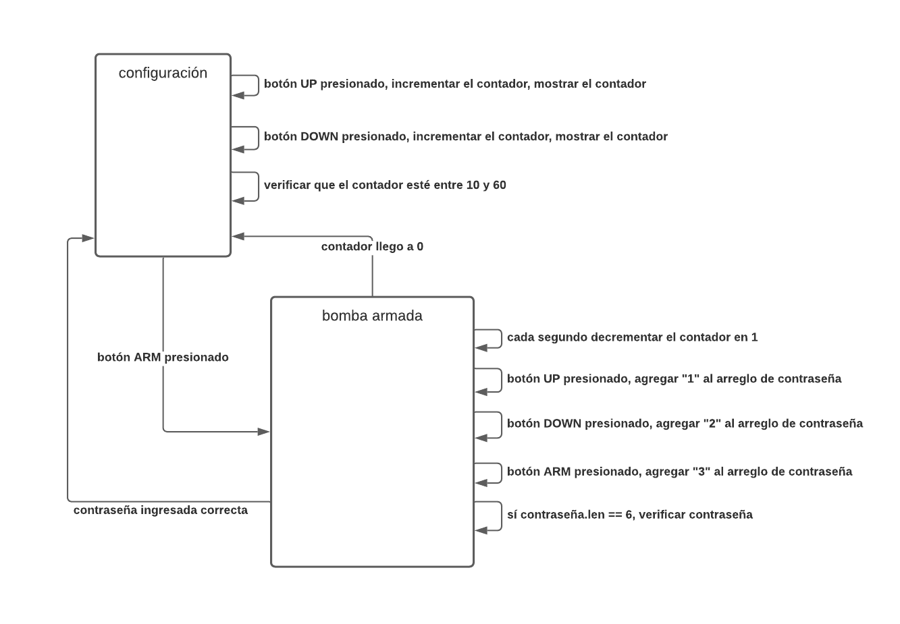

# Gabriela Lucía Vega Lopez
Fecha: 29/08/2021

## Sección 1: imagen con el diagrama de estados

## Sección 2
- [Video: Explicación del diagrama de estados](https://www.loom.com/share/a975d5e234094787a7e58099e6fdfaa3)
  
## Sección 3
- [Diagramas de los escenarios de prueba](https://lucid.app/documents/view/5c7e2a9a-7208-4403-bbf9-785f633760df)

## Sección 4
- [Video: Explicación de los escenarios](https://www.loom.com/share/d9bb64d4f32e4edb8c1c4d83ff5f9470)

## Sección 5
- [Código de la evaluación](https://github.com/vegabs/scape-room-bomb/blob/main/bomb/bomb.ino)
- [Historial de cambios](https://github.com/vegabs/scape-room-bomb/commits/main/bomb/bomb.ino)

## Sección 6
- [Video: Explicación del código](https://www.loom.com/share/79e7975cde3b445190bb3a7d43809ac5)

## Sección 6
- [Video: Escenarios 1](https://www.loom.com/share/2bcac7d40508466c9333a16e24f30476)
- [Video: Escenario 2, 3 y 4](https://www.loom.com/share/051553a784f743c18bf8b1652dbc5c5d)